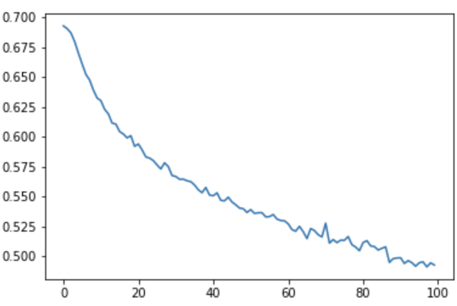

# phrase-embedding-meaningfulness

[](https://jupyter.org/try)


## Description

`phrase-embedding-meaningfulness` explores the application of a deep neural network to classify phrase meaningfulness from phrase embeddings. A pipeline to extract and rank domain-specific keyphrases from a domain-specific corpus has been implemented in this repository, using the meaningfulness classifier. The selected domain is "Computer Science". The series of pipeline steps is listed below.

This repository also includes a comparison between the new framework, AutoPhrase, ECON, and [PRDR Phrase Detection](https://github.com/harrywsh/phrase-detection) results on the same input corpus (10000 arXiv computer science paper abstracts).

## Pipeline

1. Candidate Generation

Noun phrases are extracted from the input corpus using `nltk` and `stanfordcorenlp`. Extracted noun phrases with phrase length (number of words) `<= MAX_PHRASE_LEN` are kept as candidates. `MAX_PHRASE_LEN` is set to `6`.

2. Corpus Processing

The set of phrases consists of the set of known good "Computer Science" keyphrases (selected Computer Science phrases from Wikipedia + Oxford Computer Science vocabulary), a set of randomly selected negative samples, and the set of generated candidates. With these positive samples, negative samples, and generated candidates, we replace each instance of these phrases in the corpus by its underscored equivalent. A phrase's underscored equivalent is the phrase with all instances of `' '` replaced by `'_'` (e.g. `machine learning`'s underscored equivalent is `machine_learning`). We perform this replacement to treat each phrase in our set of phrases as a single token when calculating word embeddings.

3. Embedding Construction

We use `Word2Vec`, with `WINDOW_SIZE` and `VECTOR_SIZE` as tunable hyperparameters, to generate phrase embeddings for each of the phrases in our set of phrases.

4. Classifier Training

We train a deep binary classifier to classify a phrase's meaningfulness that takes a phrase embedding of size `VECTOR_SIZE` as input, and outputs a quality-score from `0` to `1` for the phrase. The phrase is deemed meaningful if its quality-score is `>= 0.5`. The positive samples and negative samples are used to train the classifier.

6. Keyphrase Extraction and Ranking

The trained deep binary classifier is then given the candidate phrase embeddings as input. The candidate phrase's are then classified and scored to produce a ranked list of extracted keyphrases.

### Method Evaluation

The `method_evaluation.ipynb` notebook can be used to evaluate the performance of the new framework, AutoPhrase, PRDR Phrase Detection, and ECON pipelines.

## Usage

### Environment

Navigate to the `phrase-embedding-meaningfulness` directory and setup a new `conda` environment using the following commands.

```
conda create -n pem python=3.8.5 -y
conda activate pem
conda install ipykernel -y
ipython kernel install --user --name=pem
```

### Dependencies

Install the dependencies using the following command.

`pip install -r requirements.txt`

### Execution

To train and test the classifier, run the cells of the `classifier.ipynb` Jupyter notebook, using `jupyter lab`, ensuring the `pem` kernel is selected.

Run the pipeline with `sudo`, as follows: `sudo jupyter lab --allow-root`. This is required to save `Word2Vec` models and to use `stanford-corenlp`, both of which occur in the pipeline.

## Classification

### Ablation Study

| Window Size | Embedding Vector Size | Number of Epochs | Batch Normalization | Number of Layers | Minimum Frequency | Test Accuracy |
| ----------- | --------------------- | ---------------- | ------------------- | ---------------- | ----------------- | ------------- |
| 10          | 200                   | 100              | No                  | 5                | 5                 | 0.73          |
| 10          | 200                   | 200              | No                  | 5                | 5                 | 0.78          |
| 10          | 200                   | 300              | No                  | 5                | 5                 | 0.79          |
| 10          | 200                   | 250              | No                  | 5                | 5                 | 0.79          |
| 10          | 200                   | 250              | No                  | 10               | 5                 | 0.67          |
| 10          | 200                   | 1000             | No                  | 10               | 5                 | 0.77          |
| 10          | 200                   | 5000             | No                  | 10               | 5                 | 0.80          |
| 10          | 200                   | 2500             | No                  | 10               | 5                 | 0.78          |
| 10          | 200                   | 10000            | No                  | 10               | 5                 | 0.84          |

### Results

The following is a loss vs. epoch plot for the classifier's training stage (using the last set of hyperparameters in the ablation study):

<p float="left" align="center">
  
</p>

## Authors

- Rishi Masand

## References

<a href="https://dl.acm.org/doi/10.1145/3340531.3412029">[1]</a>
Li Wang, W. Zhu, Sihang Jiang, Sheng Zhang, Keqiang Wang, Yuan Ni, Guotong Xie, and Y. Xiao (2020).
Mining Infrequent High-Quality Phrases from Domain-Specific Corpora
Proceedings of the 29th ACM International Conference on Information & Knowledge Management (CIKM '20), 1535-1544.

<a href="https://towardsdatascience.com/pytorch-tabular-binary-classification-a0368da5bb89">[2]</a>
Akshaj Verma (2020).
PyTorch \[Tabular\] - Binary Classification
Towards Data Science
